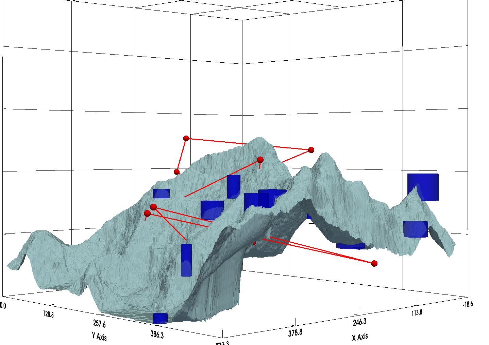

I made this grapher to help me churn through research papers faster. So far, I can create a terrain map and add obstacles. Additionally, I can plot a path as seen in pictures

Here are some pictures with a random path for demo:

first failed attempt, mismatch between how opencv reads png and how c++ does.

Path Z set at a constnat to test correct coordinate alignment

No restriction on axis

